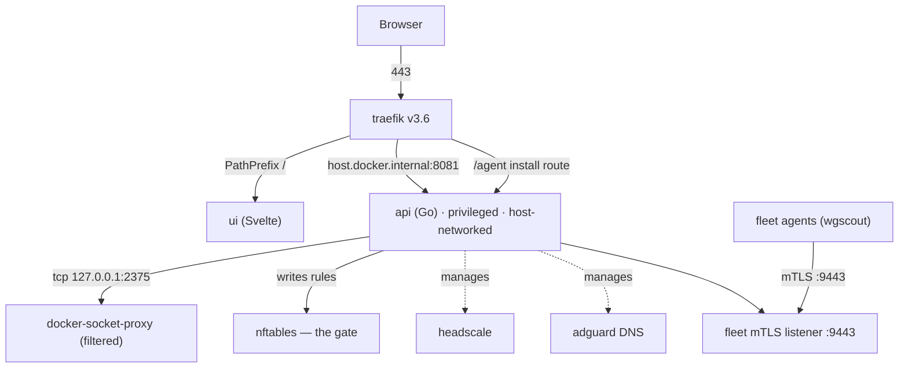
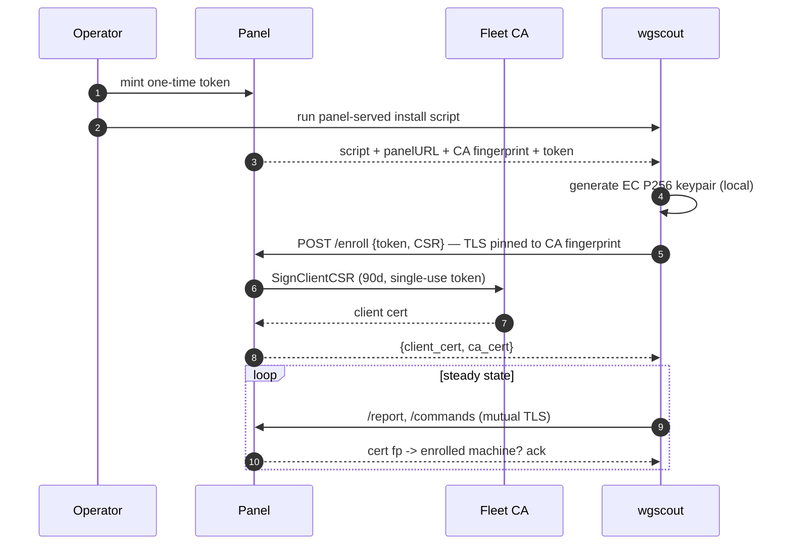
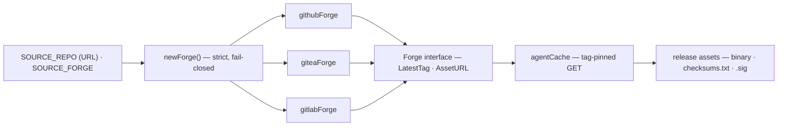
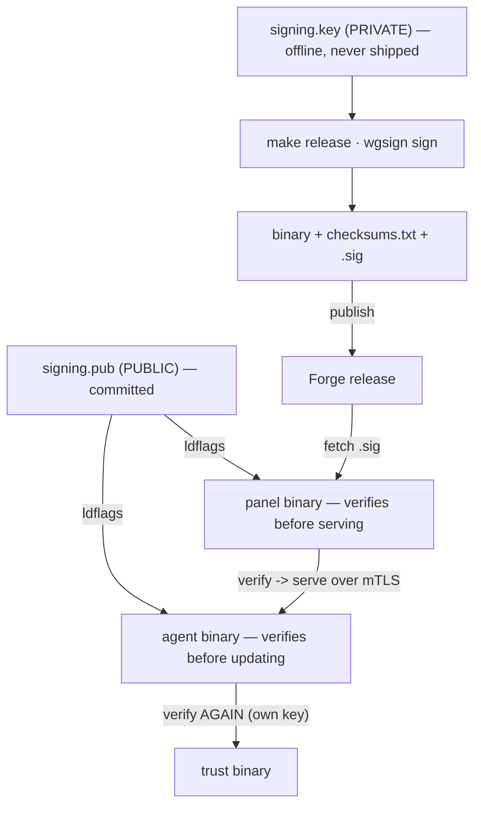
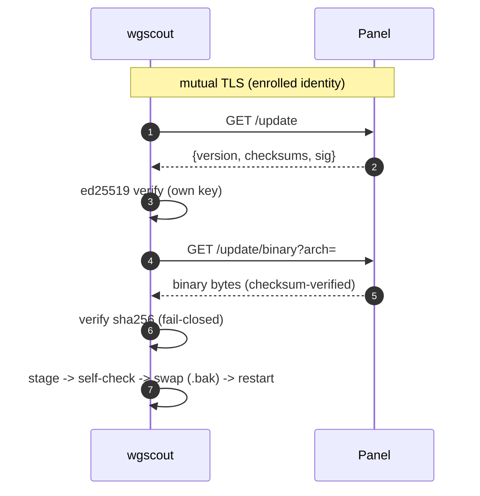
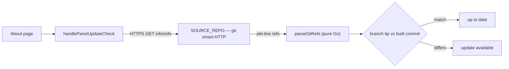

# WireGuard Admin Panel

**One dashboard for a full self-hosted networking stack** — WireGuard & Headscale VPNs, DNS filtering, reverse-proxy routing, forward proxies, an intrusion-detection firewall, a per-machine fleet agent, and traffic analytics.

It unifies manual WireGuard peer management with Headscale (Tailscale-compatible) control, AdGuard Home DNS filtering, a Traefik reverse proxy, and an nftables firewall — plus the operational tooling around them (analytics, host security, CVE scanning, encrypted backup/migrate) behind a single authenticated UI and REST API.

---

## Features

| Area | What you get |
|------|--------------|
| **VPN** | WireGuard peers (with QR codes) + Headscale nodes in one view; VPN-to-VPN ACLs enforced in nftables; cross-network routing between the two |
| **Virtual IPs** | Give a peer a virtual IP and gate reachability with ACLs — e.g. expose a single LAN device (a camera) over the VPN without opening the whole network |
| **DNS** | AdGuard Home integration: query logging, filtering controls, DNS rewrites for VPN hostnames |
| **Reverse proxy** | Traefik management + domain routes: expose internal services on custom domains (VPN-only or public) with per-route middleware, TLS, and AdGuard rewrites |
| **Tunnels** | Authenticated HTTP/SOCKS5 forward proxies — direct or chained through a VPN node — with per-tunnel credentials, live stats, and provider IP rotation |
| **Webhooks** | Validating pass-through triggers: declare a strict inbound contract (method, params, patterns) and forward to any URL |
| **Firewall** | nftables rules, port allowlisting, manual/auto IP blocking, fail2ban-style jails with CIDR escalation, blocklist import |
| **Geolocation** | Country-based traffic blocking (MaxMind / IP2Location / IPdeny), IP lookup, auto DB updates |
| **Analytics** | Unified inbound / DNS / outbound / firewall logs, per-node usage, top talkers, a world map, and time-series charts from 1 hour to all time (backed by hourly rollups) |
| **Fleet** | Enroll remote machines over mTLS: live CPU/mem/disk metrics with history, CVE scanning grouped by OS/project, targeted package fixes, and one-click agent self-update |
| **Host security** | Read-only telemetry for the panel server: resource usage, listening ports, certificate expiry, recent package changes |
| **Backup & migrate** | Passphrase-encrypted export of the full configuration (AES-256-GCM) and import onto a fresh host |
| **Security** | Session auth (bcrypt) + TOTP 2FA, API keys, rate limiting, device/location tracking, encrypted secrets at rest |
| **PWA** | Installable on mobile/desktop, push notifications, offline detection, map visualization |

The About page inside the panel lists every capability, the running **build version**, and a live API reference.

## Tech Stack

**Backend** — Go 1.24 · SQLite (WAL) · gorilla/websocket · wgctrl · MaxMind/IP2Location
**Frontend** — Svelte 5 (runes) · Tailwind CSS 4 · Vite 7 · uPlot charts · Leaflet maps
**Infrastructure** — Docker Compose · Traefik · Headscale · AdGuard Home · nftables

## Installation

### Prerequisites
- Linux server with root access
- Docker & Docker Compose
- WireGuard kernel module

### Quick start (managed install)
```bash
curl -fsSL https://raw.githubusercontent.com/packalyst/wireguard-admin-panel/main/install.sh | sudo bash
```
This clones the panel into `/opt/wire-panel`, registers a `wire-panel.service` systemd unit (starts on boot), installs a `wire-panel` command, and runs first-time setup. Afterwards manage it from anywhere with `sudo wire-panel` (interactive), `sudo wire-panel update`, `sudo systemctl {start,stop,status} wire-panel`.

### Manual install
```bash
git clone https://github.com/packalyst/wireguard-admin-panel.git
cd wireguard-admin-panel
chmod +x manage.sh
./manage.sh
```

`manage.sh` checks/installs dependencies, auto-detects your public IP, walks you through interactive setup, generates the configuration, stamps the build version, and starts every service. Re-run it any time to reconfigure; `./manage.sh update` pulls and rebuilds.

### Migrate an existing checkout to the managed layout
Already running from a plain `git clone`? Move it into `/opt/wire-panel` + systemd in one step — it stops the stack, carries the database volume across (verified before the old one is removed), and brings everything back up:
```bash
./manage.sh migrate
```

### Access
| Service | URL |
|---------|-----|
| Dashboard | `http://YOUR_SERVER_IP/` |
| Traefik dashboard | `http://YOUR_SERVER_IP:8080` |
| AdGuard Home | `http://YOUR_SERVER_IP:8083` |
| API | `http://YOUR_SERVER_IP:8081` |

### First login
Default credentials are `admin` / `admin` — **change them immediately after first login.**

## Configuration

Core settings live in `.env` (see `.env.example` for the full list).

| Variable | Description | Default |
|----------|-------------|---------|
| `SERVER_IP` | Public IP of your server | Required |
| `ENCRYPTION_SECRET` | Key for encrypting secrets at rest | Required — `openssl rand -hex 32` |
| `WG_INTERFACE` | WireGuard interface name | `wg0` |
| `WG_PORT` | WireGuard UDP port | `51820` |
| `WG_IP_RANGE` | IP range for WireGuard peers | `10.8.0.0/16` |
| `WG_SERVER_IP` | WireGuard gateway IP | `10.8.0.1` |
| `HEADSCALE_IP_RANGE` | IP range for Headscale clients | `100.64.0.0/16` |
| `HEADSCALE_BASE_DOMAIN` | DNS base domain for Headscale | `vpn.local` |

**Service ports** — `HTTP_PORT` (80), `HTTPS_PORT` (443), `TRAEFIK_PORT` (8080), `API_PORT` (8081), `ADGUARD_PORT` (8083), `DNS_PORT` (53), `STUN_PORT` (3478).

**Security** — `TRUSTED_PROXIES` (IPs allowed to set `X-Forwarded-For`, defaults to the Traefik container) · `IGNORE_NETWORKS` (networks excluded from the firewall, defaults to private ranges).

### SSL / HTTPS
Enable Let's Encrypt certificates in `.env`:
```bash
SSL_ENABLED=true
SSL_DOMAIN=vpn.example.com
LETSENCRYPT_EMAIL=admin@example.com
```

## Backup & migrate

From **Settings → Backup**, export a passphrase-encrypted archive of your full configuration (AES-256-GCM, PBKDF2-SHA256). Import it onto a fresh install to migrate the panel between hosts — it restores users, settings, VPN clients, routes, and fleet configuration in one step.

## Fleet agent

A lightweight per-machine agent (distributed via GitHub Releases) enrolls with the panel over **mTLS** and reports metrics, CVE scans (Trivy), and inventory. Manage machines, drill into vulnerabilities, apply targeted OS-package fixes, and trigger agent self-updates from the **Machines** page. Install it with the panel-served installer; enrollment is one-time-token based.

## Architecture

The supply chain for the fleet agent (`wgscout`) is built so that **no single compromise — the panel included — can push a malicious binary**. The forge, host, and repo are all configurable; nothing about a specific repository is baked into the Go binary.

### Overall stack

The `api` runs in the host network namespace (privileged, `CAP_NET_ADMIN`) because it programs the host firewall — **nftables is the gate**. Being host-networked it has no Docker hostname, so Traefik reaches it at `host.docker.internal:8081`. It never touches the Docker socket directly, only a filtered `docker-socket-proxy`.



### Enrollment &amp; mTLS trust

A one-time token becomes a long-lived mutual-TLS identity. The agent generates its **own** keypair locally, pins the panel's **CA fingerprint** (no trust-on-first-use), and enrolls; the panel redeems the single-use token and signs a 90-day client cert. Every later call is gated at the TLS handshake against an enrolled, non-revoked machine.



### Forge abstraction

Identity comes from `SOURCE_REPO` (a full URL) + `SOURCE_FORGE`, derived by `manage.sh` from the git remote. `newForge` parses strictly (https only, exactly `owner/repo`, fail-closed on an unknown host) and returns a driver for GitHub, Gitea/Forgejo, or GitLab. Every URL segment is allowlist-validated and percent-escaped, and a forge-returned tag is re-validated before it can build a download URL.



### Release signing &amp; verification (ed25519)

The root of trust is an **offline ed25519 key**. On the release machine, `make release` signs `checksums.txt` with the **private** key (`signing.key` — never on the panel). The **public** key (`signing.pub`) is committed and compiled into **both** the panel and the agent. The panel verifies before serving; the agent verifies **again itself** — so even a compromised panel cannot feed a tampered binary. When no key is built in, signature enforcement is off and binaries fall back to SHA-256 over TLS/mTLS (the pre-signing baseline).



### Agent self-update via the panel

An agent updates by asking **its own panel** over the CA-pinned mTLS channel — it has **no forge coupling**. It verifies the signature with its own baked-in key, then the SHA-256, then stages beside the live binary, self-checks it runs, atomically swaps in a `.bak`, and restarts after the ack flushes.



### Panel update-check

The panel deploys by `git pull`, so its version is the commit it was built from. Its "is there an update?" answer uses the **git smart-HTTP protocol** — a plain HTTPS GET of `info/refs`, parsed in pure Go. No git binary, no subprocess, so there is no `ext::`/`file://` command-execution surface. The About page shows the resulting badge.



### Trust model summary

| Anchor | What it protects |
|--------|------------------|
| **Offline ed25519 signing key** (`signing.key`) | Authenticity of every agent release; private half never on the panel |
| **Baked-in public key** (`signing.pub`) | Panel and agent independently verify signatures; compiled in, not runtime-configurable |
| **Fleet CA** (ECDSA P256, encrypted at rest) | Issues agent client certs + the panel's mTLS server cert; only enrolled machines are obeyed |
| **CA-fingerprint pinning** | Closes trust-on-first-use at enrollment |
| **SHA-256 checksums** (verified twice) | Integrity of each downloaded binary, checked by panel *and* agent, fail-closed |
| **TLS / mutual TLS** | Report/command/update endpoints reject certless or foreign-cert connections at the handshake |

## Development

Enable hot reload during setup (`./manage.sh` → answer `y` to development mode) or set `DEV_MODE=true` in `.env`. Svelte changes then reflect instantly without a rebuild.

## Project structure

```
├── api/                     # Go backend
│   ├── cmd/                 # Entry point (main.version stamped at build)
│   ├── configs/             # Endpoint configuration (endpoints.json)
│   └── internal/
│       ├── auth/ (+pwa/)    # Auth, 2FA, push, device location
│       ├── vpn/ wireguard/ headscale/   # Unified VPN, WG peers, HS proxy
│       ├── firewall/ nftables/          # Rules, jails, traffic; nftables tables
│       ├── domains/ traefik/            # Domain routes; reverse-proxy config
│       ├── turbotunnels/                # Forward proxies + IP rotation + webhooks
│       ├── logs/ retention/             # Analytics, rollups, central retention
│       ├── fleet/ server/ serverstats/  # Fleet agent, host security, live stats
│       ├── geolocation/ adguard/ docker/
│       ├── backup/ settings/ setup/ events/ stats/
│       ├── database/ helper/ router/ ws/
├── ui/                      # Svelte 5 frontend
│   └── src/{views,components,stores,lib}/
├── headscale/ traefik/ adguard/   # Service configs
├── deploy/                  # systemd unit + wire-panel CLI wrapper
├── docker-compose.yml       # Container orchestration
├── install.sh               # Managed install (clone → /opt/wire-panel + service)
└── manage.sh                # Install / update / configure / migrate
```

## API

RESTful JSON with `Authorization: Bearer <token>`. Services are grouped by prefix:

`/api/auth` · `/api/pwa` · `/api/wg` · `/api/hs` · `/api/vpn` · `/api/fw` · `/api/geo` · `/api/traefik` · `/api/domains` · `/api/adguard` · `/api/turbotunnels` · `/api/logs` · `/api/fleet` · `/api/server` · `/api/docker` · `/api/backup` · `/api/events` · `/api/settings` · `/api/ws`

The **About → API Reference** tab renders every endpoint live from the running schema.

## Security notes

- All endpoints require authentication except initial setup.
- WireGuard private keys are stripped before database storage; sensitive settings (API keys, tokens, authkeys) are encrypted at rest.
- Headscale API access is restricted to VPN networks; the Docker socket is reached only through docker-socket-proxy with limited permissions.
- Rate limiting is applied to authentication and sensitive endpoints; security headers are set on all responses.
- The panel's direct-IP access can be closed once a domain is configured, leaving the API reachable only via the domain, localhost, and WireGuard.

## License

MIT
