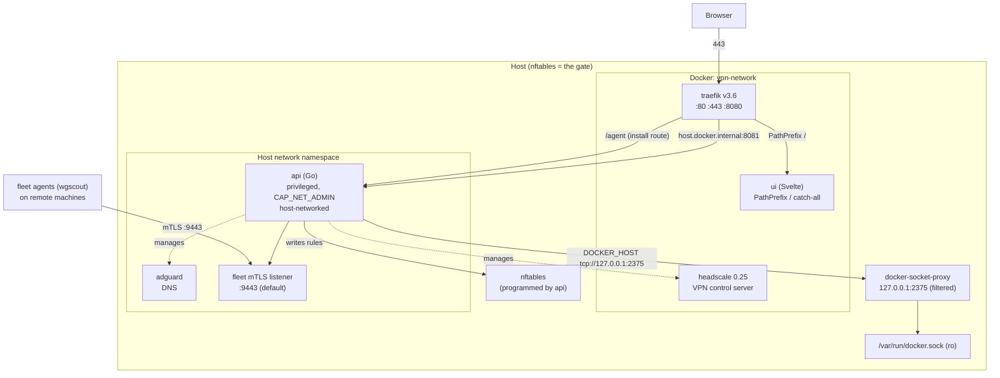
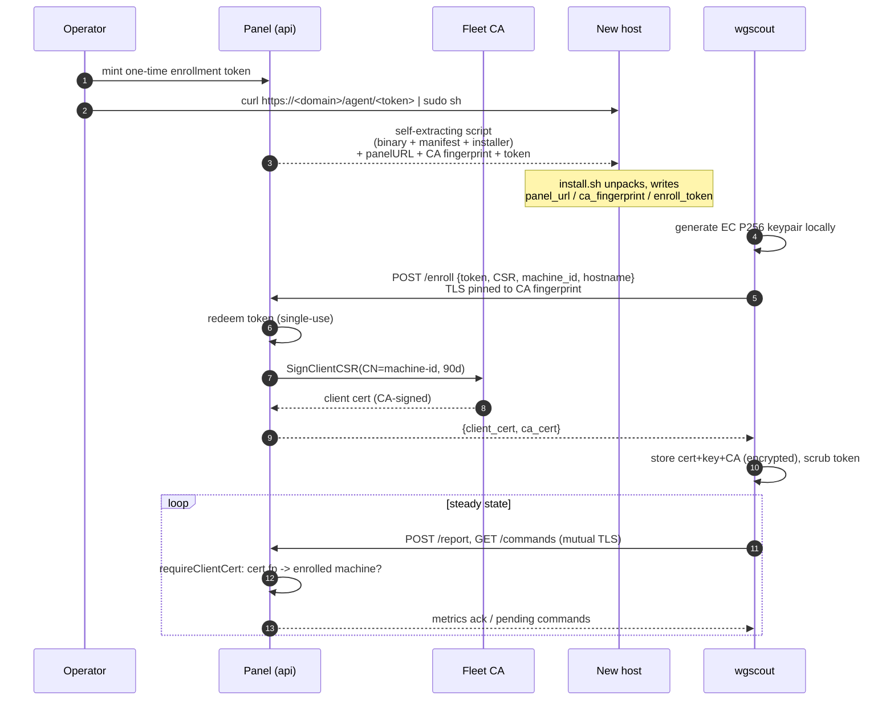
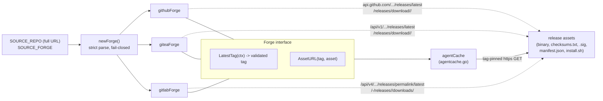
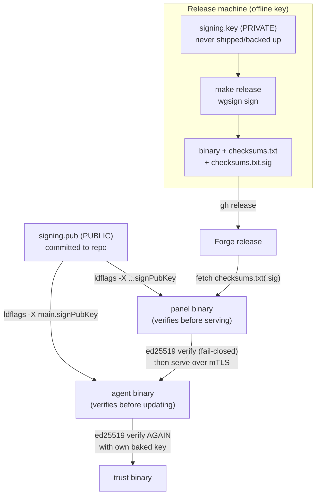
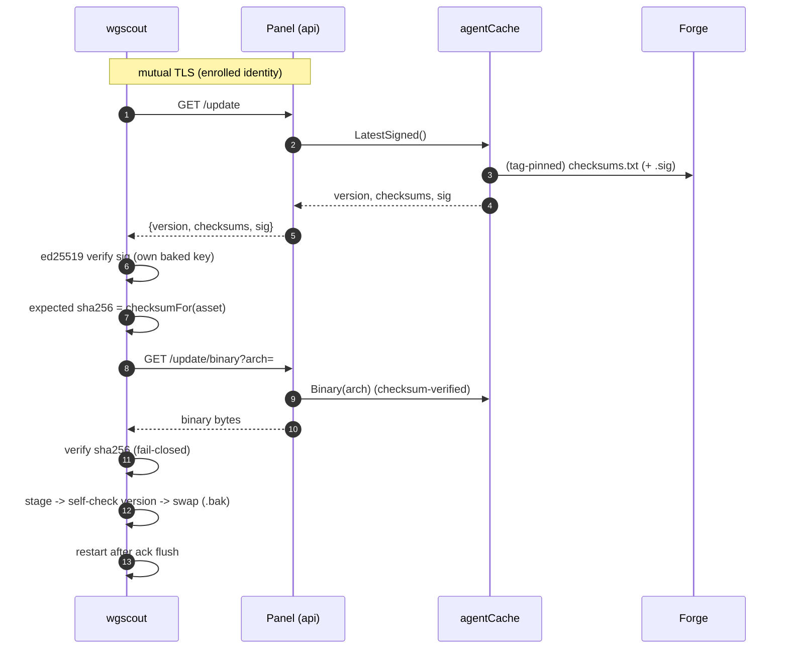
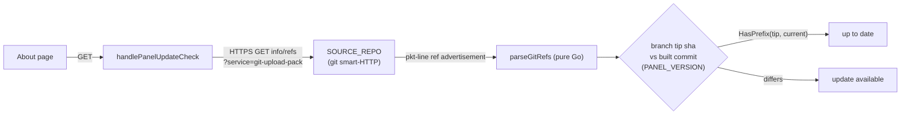

# Architecture

This document describes how the WireGuard/Headscale admin panel is put together, with
emphasis on the **fleet-agent supply chain** — how a per-machine agent (`wgscout`) is
enrolled, trusted, and kept up to date without ever hardcoding a repository or shipping a
private key onto the panel.

Components:

- **Go backend** — `api/` (single binary, built into the `api` container).
- **Svelte 5 frontend** — `ui/`.
- **Fleet agent** — `agent/` (the `wgscout` binary that runs on managed hosts).
- **Orchestration** — `docker-compose.yml` + `manage.sh`.

---

## 1. Overall stack

The stack is a set of containers orchestrated by `docker-compose.yml`. The `api` runs in the
host network namespace (`network_mode: host`, `privileged`, `CAP_NET_ADMIN`) because it is the
component that programs the host firewall — **nftables is the gate**; nothing reaches a
protected service except through rules the panel writes. Because the `api` is host-networked
it has no in-Docker hostname, so Traefik reaches it via `host.docker.internal:8081`
(`traefik/dynamic/core.yml`, and the generated fleet route in
`api/internal/traefik/traefik.go`). The `api` never touches the Docker socket directly: it
talks to a filtered `docker-socket-proxy` on `127.0.0.1:2375` (`DOCKER_HOST` env).

The browser UI is a separate `ui` container on the internal `vpn-network`, served by Traefik
as the `PathPrefix(`/`)` catch-all (priority 1), so higher-priority routes like `/agent` win.

Notable: the install-script download (`/agent/<token>`) and the browser UI both ride
Traefik/443 with the panel's real certificate, while the fleet **mTLS channel**
(enroll/report/commands/update) is a *separate* TLS listener on `:9443`
(`api/internal/fleet/service.go`, `defaultPort = 9443`) — one guarded download door, one mutual-
TLS control channel.

---

## 2. Fleet agent enrollment and mTLS trust

Enrollment turns a one-time token into a long-lived mutual-TLS identity. The operator mints a
token; the agent host runs a **panel-served, self-extracting install script**
(`GET /agent/{token}`, mounted in `api/cmd/main.go` and published over Traefik/443 —
`api/internal/fleet/install.go`). That script carries the agent binary, manifest, and real
installer base64-embedded, plus three spliced values: the panel's mTLS URL (a direct
`https://<ip>:9443`), the **CA fingerprint** (`sha256:...`), and the token.

The agent then generates its **own** EC P256 keypair locally (the private key never leaves the
host), builds a CSR, and POSTs it to `/enroll` — verifying the panel's server certificate
against the **pinned CA fingerprint** (`agent/register.go`, `pinnedTLS`), so there is no
trust-on-first-use. The panel redeems the token (atomic, single-use), signs a short-lived
client certificate with its CA (`SignClientCSR`, 90-day TTL), records the machine, and returns
the client cert plus the CA cert. From then on every report/command call is gated at the TLS
handshake (`VerifyClientCertIfGiven` + `requireClientCert`, which also checks the cert
fingerprint maps to an enrolled, non-revoked machine).

**Trust anchors in this flow** — the CA private key is generated on the panel and stored
**encrypted** at rest (AES-256-GCM via `ENCRYPTION_SECRET`, `api/internal/fleet/ca.go`); the
agent's private key never transits (panel only ever sees a CSR); the token is single-use; and
the CA fingerprint is pinned out-of-band via the install script.

---

## 3. Forge abstraction

Nothing about a specific repository is baked into the Go binary. The repo identity comes
entirely from the environment: `SOURCE_REPO` (a full `https://host/owner/repo` URL) plus
`SOURCE_FORGE` (`github` | `gitea` | `gitlab`). `manage.sh` (`detect_source_repo`) derives
these from the checkout's own `git remote` — pointing the panel at the *same* remote it
`git pull`s from, so a fork or mirror is picked up automatically.

`newForge` (`api/internal/fleet/forge.go`) parses `SOURCE_REPO` strictly (https only, exactly
`owner/repo`, fail-closed on an unknown host unless `SOURCE_FORGE` is set) and returns a driver.
Each driver knows two things: the **release-asset URL scheme** and the **latest-release**
API endpoint for its forge. Every value that flows into a URL is allowlist-validated and
percent-escaped, and a tag returned by the (untrusted) forge is re-validated before it can be
used to build a download URL.

`agentCache` resolves the latest tag via `LatestTag`, then **tag-pins** all asset downloads to
that resolved tag. `checksums.txt` doubles as the version marker: at most every 5 minutes the
cache re-fetches it, and if the tag or content changed it purges and re-seeds the on-disk cache
under the new tag. A missing/invalid `SOURCE_REPO` leaves the forge `nil` and asset serving /
version checks degrade gracefully.

---

## 4. Release signing and verification (ed25519)

The supply-chain root of trust is an **offline ed25519 key**. On the release machine,
`make release` (`agent/Makefile`) builds the binaries, writes `checksums.txt`, and signs it
with the **private** key (`signing.key`, base64, chmod 600, gitignored, never on the panel) via
`agent/tools/wgsign` — producing `checksums.txt.sig`. All artifacts, including the signature,
are published as a forge release.

The matching **public** key (`signing.pub`) is committed to the repo and baked into **both** the
panel and the agent at build time via `ldflags`:

- Panel: `PANEL_SIGN_PUBKEY` build arg → `-X api/internal/fleet.signPubKey` (`api/Dockerfile`,
  set by `manage.sh` from `signing.pub`).
- Agent: `-X main.signPubKey` (`agent/Makefile`, read from `../signing.pub`).

When a key is baked in (`signingEnabled()`), verification is **fail-closed**: the panel refuses
to serve a release whose `checksums.txt` lacks a valid signature, and the agent verifies the
signature *again itself* before updating — so even a compromised panel cannot feed a tampered
binary. The private key exists only on the release machine.

**Trust root = the offline signing key.** The committed `signing.pub` lets anyone rebuild a
panel/agent that enforce the same signature; the panel is only a *cache and relay*, never a
trust authority for release contents.

---

## 5. Agent self-update through the panel

An agent updates itself by asking **its own panel** over the already-trusted, CA-pinned mTLS
channel — it has **no forge coupling** whatsoever (only the panel talks to the forge). The
`update-agent` command triggers `selfUpdate` (`agent/selfupdate.go`):

1. `GET /update` (mTLS) → latest `version`, raw `checksums`, and `sig`
   (`api/internal/fleet/agentupdate.go`, backed by `agentCache.LatestSigned`).
2. If a signing key is baked in, **verify the ed25519 signature** over `checksums` with the
   agent's own key — before trusting the checksums list.
3. Look up the expected SHA-256 for `wgscout-linux-<arch>` from the now-authenticated checksums.
4. `GET /update/binary?arch=` → download and verify the **SHA-256** (fail-closed).
5. **Stage** beside the live binary (`.wgscout.new`, exec bit set — never in a possibly-noexec
   `/tmp`).
6. **Self-check**: run the staged binary's `version` — catches a wrong-arch or corrupt-but-
   hash-matched download before touching the live binary.
7. **Swap**: back up the live binary to `.bak`, then atomically `rename` the staged one in.
8. **Restart** (via `systemctl`) *after* the command ack flushes, so the panel records success
   before the process is replaced.

The panel's `/update` and `/update/binary` are on the mTLS listener behind
`requireClientCert`, so only enrolled machines can pull.

---

## 6. Panel update-check

The panel itself deploys by `git pull`, so its "version" is the commit it was built from
(`PANEL_VERSION` = `git rev-parse --short HEAD`, baked in via `ldflags`; `PANEL_BRANCH` too).
Its "is there an update?" answer is: **does the branch tip on `SOURCE_REPO` differ from the
built commit?**

`handlePanelUpdateCheck` (`api/internal/server/panelupdate.go`) answers this using the **git
smart-HTTP protocol** — a plain HTTPS `GET .../info/refs?service=git-upload-pack`, which every
forge speaks identically. It parses the pkt-line ref advertisement in Go
(`parseGitRefs`), reads the deploy branch's tip SHA, and compares. There is **no git binary and
no subprocess**, so there is no `ext::`/`file://` git-remote-helper command-execution surface;
only https is contacted, and the result is cached for 10 minutes. The About page shows an
"up to date / update available" badge from the result (`up_to_date`, `checked`).

---

## Trust model summary

The system's security rests on a small set of explicit anchors — no single compromise
(including of the panel itself) is enough to push a malicious agent binary:

| Anchor | What it protects | Where |
| --- | --- | --- |
| **Offline ed25519 signing key** (`signing.key`) | Authenticity of every agent release; root of the supply chain. Private half never on the panel. | `agent/tools/wgsign`, `agent/Makefile` |
| **Baked-in public key** (`signing.pub`) | Both panel *and* agent independently verify release signatures; verification is compiled in, not runtime-configurable. | `-X ...signPubKey` (`api/Dockerfile`, `agent/Makefile`) |
| **Fleet CA** (ECDSA P256, key encrypted at rest) | Issues agent client certs + the panel's mTLS server cert; only CA-signed, enrolled machines are obeyed. | `api/internal/fleet/ca.go` |
| **CA-fingerprint pinning** | Closes trust-on-first-use at enrollment — agent refuses a panel whose CA doesn't match the pinned `sha256:...`. | `agent/register.go` (`pinnedTLS`) |
| **SHA-256 checksums** | Integrity of each downloaded binary, verified by panel *and* agent (fail-closed). | `agentcache.go`, `agent/selfupdate.go` |
| **TLS / mutual TLS** | Confidential, authenticated transport; report/command/update endpoints reject certless or foreign-cert connections at the handshake. | `api/internal/fleet/listener.go`, `mtls.go` |

Supporting properties: one-time, hashed enrollment tokens; short-lived client certs bound to a
machine identity; agent private keys that never leave the host; and a panel that is only a
**cache/relay** for signed releases — never itself a trust authority for their contents.
