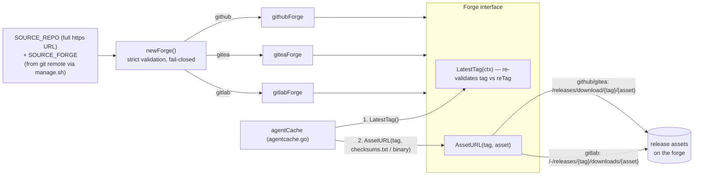
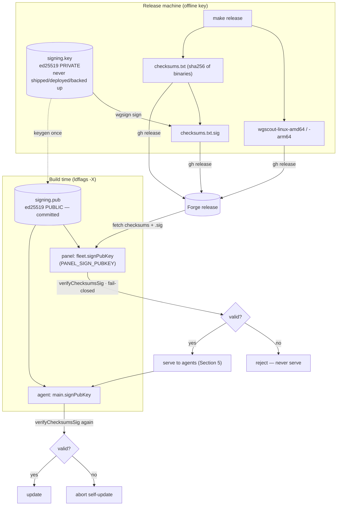
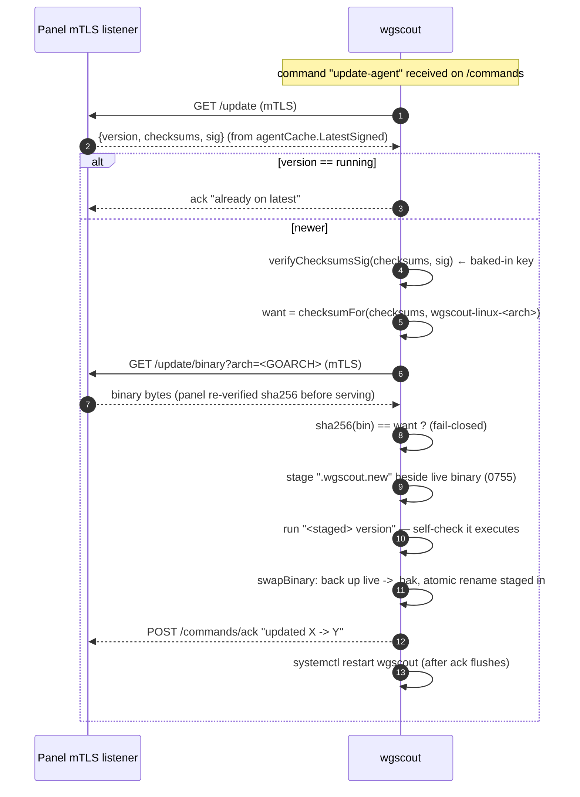
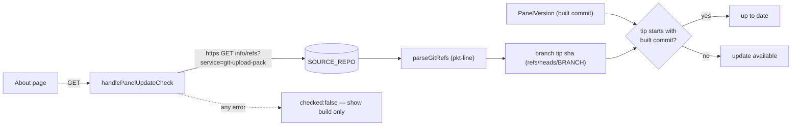

# Architecture

A self-hosted WireGuard / Headscale admin panel. Three code trees, orchestrated by
`docker-compose.yml` and `manage.sh`:

- **`api/`** — the Go backend (single binary, host-networked, privileged). Owns the
  firewall, WireGuard, Headscale/AdGuard/Traefik config, and the **fleet** subsystem
  (`api/internal/fleet/`) that manages per-machine agents.
- **`ui/`** — the Svelte 5 single-page app, served by its own container behind Traefik.
- **`agent/`** — `wgscout`, the per-machine fleet agent installed on managed hosts. It
  reports metrics/CVEs and executes a fixed allowlist of commands over mutual TLS.

The rest of this document is diagram-first; the prose only frames each diagram. The
emphasis is the fleet-agent **supply-chain path**: how an agent is enrolled, how its
binary is sourced and pinned, how releases are signed, and how it updates itself — all
without any repo or forge identity being hard-coded into the Go binaries.

---

## 1. Overall stack

The panel runs as a Docker Compose stack. Two containers use **host networking**
(`api`, `adguard`); the rest sit on the `vpn-network` bridge. Traefik terminates TLS on
:443 and is the single public front door. Because `api` is host-networked (not on the
bridge), Traefik cannot reach it by service name — it reaches it via
`host.docker.internal:8081` (wired through `extra_hosts: host.docker.internal:host-gateway`
in `docker-compose.yml`, routed by `traefik/dynamic/core.yml`). The UI container owns the
catch-all `PathPrefix(`/`)` route; `/api/*` is routed to the host `api`. The **nftables
firewall**, owned by the `api` process (`api/internal/firewall/`), is the security gate —
nothing reaches WireGuard/Headscale/managed ports unless the firewall admits it, and every
ruleset change is validated with `nft -c` before being applied.

```mermaid
flowchart TB
    subgraph internet[Internet / WireGuard clients]
        browser[Admin browser]
        wgclient[WG / Tailscale clients]
        agents[Fleet agents wgscout]
    end

    nft["nftables firewall<br/>(the gate — owned by api,<br/>validated with nft -c)"]

    subgraph host[Panel host]
        subgraph bridge[vpn-network bridge]
            traefik["traefik :80/:443/:8080"]
            ui["ui container<br/>Svelte SPA · PathPrefix('/')"]
            headscale["headscale :8080 (internal)"]
        end
        subgraph hostnet[host network namespace]
            api["api (Go)<br/>host-networked · privileged · pid:host<br/>firewall · WG · fleet mTLS listener"]
            adguard["adguard DNS"]
        end
        dsp["docker-socket-proxy<br/>127.0.0.1:2375 (filtered)"]
        sock[("/var/run/docker.sock :ro")]
    end

    browser -->|HTTPS 443| nft --> traefik
    wgclient --> nft
    agents -->|mTLS direct IP| nft
    traefik -->|"PathPrefix('/')"| ui
    traefik -->|"/api/* via host.docker.internal:8081"| api
    traefik -->|/agent/{token} install download| api
    traefik --> headscale
    api -->|DOCKER_HOST=tcp://127.0.0.1:2375| dsp --> sock
    api --> adguard
```

Notes worth carrying forward:

- `docker-socket-proxy` exposes a filtered Docker API on loopback `:2375`; `api` talks to
  it via `DOCKER_HOST` rather than mounting the raw socket. It currently runs with `EXEC=1`
  (needed for the headscale CLI) — flagged in-compose as a tracked follow-up to remove.
- The agent's mTLS channel (Section 2) does **not** go through Traefik/443 — only the
  `/agent/{token}` **install download** does. The mTLS listener is a separate port.

---

## 2. Fleet agent enrollment & mTLS trust

Enrollment turns a one-time token into a pinned, cert-authenticated identity, with **no
trust-on-first-use**. The operator mints a token; the new host runs the panel-served
self-extracting installer; the agent generates its own keypair, gets a CA-signed client
cert, and pins the panel CA fingerprint out-of-band. Two distinct doors:

- **Install download** — `GET /agent/{token}?arch=` on the **main api router**, published
  over Traefik/443 (`api/internal/fleet/install.go::HandleInstallScript`). The response is
  a self-extracting `#!/bin/sh` script with the agent binary, manifest, and the real
  `install.sh` base64-embedded, plus `--panel`, `--ca-fp`, and `--token` spliced in.
- **mTLS listener** — a separate managed TLS server (default **:9443**, Settings-controlled,
  `service.go`) carrying `/enroll` and all report/command endpoints (`listener.go`).

The listener uses `tls.VerifyClientCertIfGiven`: `/enroll` needs no client cert (the token
is the credential), but any presented cert must be CA-signed, and the report/command
endpoints additionally require the cert's fingerprint to map to an enrolled, non-revoked
machine (`mtls.go::requireClientCert`).

```mermaid
sequenceDiagram
    autonumber
    participant Op as Operator (panel UI)
    participant Api as Panel api router (Traefik/443)
    participant Host as New host
    participant Agent as wgscout
    participant Mtls as Panel mTLS listener (:9443)
    participant CA as Fleet CA

    Op->>Api: mint one-time token (records panel host IP)
    Op-->>Host: curl https://panel/agent/{token}?arch=... | sudo sh
    Host->>Api: GET /agent/{token}?arch=x86_64
    Api-->>Host: self-extracting script (binary + install.sh<br/>+ panel URL + CA fingerprint + token)
    Host->>Agent: install.sh runs; systemd unit installed
    Agent->>Agent: generate EC P-256 key (never leaves host)<br/>build CSR
    Note over Agent: refuses to enroll if no CA fingerprint pinned<br/>(no TOFU) — enroll.go / register.go
    Agent->>Mtls: POST /enroll {token, CSR, machine_id, hostname}<br/>server cert verified against PINNED CA fp
    Mtls->>Mtls: redeem token (atomic, single-use)
    Mtls->>CA: SignClientCSR(CN=machine id, 90-day TTL)
    CA-->>Mtls: client cert (PEM)
    Mtls-->>Agent: {machine_id, client_cert, ca_cert}
    Agent->>Agent: store cert+key+CA in encrypted store;<br/>scrub token from config
    loop steady state (mutual TLS)
        Agent->>Mtls: POST /report · /cve-report (client cert)
        Mtls->>Mtls: requireClientCert: fp -> enrolled, non-revoked
        Agent->>Mtls: GET /commands -> exec allowlist -> POST /commands/ack
    end
```

**Trust anchors established here:** the agent pins the panel **CA SHA-256 fingerprint**
(delivered in the install command, verified in `register.go::pinnedTLS`), so a rogue panel
with a different CA fails the handshake. The panel trusts the agent only via a cert its own
CA signed *and* that still maps to a live machine.

---

## 3. Forge abstraction — repo identity lives in the environment

The panel serves agent binaries by pulling them **live** from the project's git-forge
release, so the repo ships no binaries and a new agent version ships with a plain
`gh release` (no panel rebuild). Crucially, **nothing about a specific repo is baked into
the Go binary**: identity comes entirely from `SOURCE_REPO` (a full https URL) plus
`SOURCE_FORGE` (`github` | `gitea` | `gitlab`). `manage.sh::detect_source_repo` derives
these from the checkout's `git remote origin` and writes them to `.env`;
`docker-compose.yml` defaults them. `newForge` (`forge.go`) parses them fail-closed
(https only, exactly `owner/repo`, host auto-detect only for `github.com`) and returns a
driver that knows that forge's asset-URL and latest-release schemes.



`agentCache` resolves the latest tag once, then **tag-pins** every subsequent download to
that exact tag. Every value flowing into a URL (host, owner, repo, tag, asset) is allowlist-
validated and percent-escaped, and the tag returned by the (untrusted) forge is re-validated
against `reTag` — a hostile forge cannot return `../..` or an absolute URL to redirect a
download. Freshness is cheap: the tiny `checksums.txt` is the version marker; at most every
5 minutes the cache re-fetches it, and only a change triggers a full cache purge + re-fetch.

---

## 4. Release signing & verification (ed25519)

The supply-chain trust root is an **offline ed25519 key** that never exists on the panel or
any agent. On the release machine, `make release` (`agent/Makefile`) builds both arch
binaries, writes `checksums.txt`, and signs it with the **private** key (`signing.key`,
chmod 600, gitignored) via the stdlib-only signer `agent/tools/wgsign`. The detached
`checksums.txt.sig` is uploaded alongside the release. The matching **public** key
(`signing.pub`) is committed and **baked into both the panel and the agent at build time**
via `-ldflags -X` (panel: `api/internal/fleet.signPubKey` from `PANEL_SIGN_PUBKEY`; agent:
`main.signPubKey`). The panel verifies the signature before serving a release
(`agentcache.go::refreshLocked` → `signing.go::verifyChecksumsSig`, fail-closed), and the
agent verifies it **again** itself before updating (Section 5) — so even a compromised panel
cannot feed an agent a tampered binary.



When no public key is baked in (empty `signPubKey`), signature enforcement is **disabled**
and the system falls back to sha256-over-the-mTLS-channel trust — so unsigned/legacy
releases still work. Once a key is present, **every** release the panel serves MUST carry a
valid `checksums.txt.sig`.

---

## 5. Agent self-update through the panel

An agent never talks to the forge. When it receives the `update-agent` command over mTLS,
it pulls its own new binary **from its panel** over the already-trusted CA-pinned channel
(`agent/selfupdate.go`), so it needs zero forge access or configuration. It still performs
the full verification chain itself: ed25519 signature (with its baked-in key) → per-binary
sha256 → run the staged binary once to confirm it executes → atomic swap → restart.



Two panel endpoints back this, both mTLS-gated (`api/internal/fleet/agentupdate.go`):
`GET /update` returns version + signed checksums; `GET /update/binary?arch=` streams the
checksum-verified binary. The agent stages next to the live binary (never `/tmp`, which may
be `noexec`) and keeps a `.bak`. The `update-agent` command ignores the agent's dry-run
flag — it is an explicit panel action on the agent's own binary, not host enforcement.

---

## 6. Panel update-check

The panel itself deploys by `git pull`, so its "version" is the commit it was built from
(`PanelVersion`, a short sha stamped in by `manage.sh` via `-ldflags`). To answer "is there
a newer panel?", `api/internal/server/panelupdate.go` performs a plain **git smart-HTTP**
`GET .../info/refs?service=git-upload-pack` against `SOURCE_REPO`, parses the pkt-line ref
advertisement, and compares the deploy branch's tip (`PanelBranch`) to the built commit.
No `git` subprocess is spawned (so there is no `ext::`/`file://` remote-helper execution
surface); only https is contacted, and the tip is cached for 10 minutes. The About page
shows an "up to date / update available" badge; any failure degrades to `checked:false`
(just the build, no badge).



---

## Trust model summary

| Anchor | What it protects | Where |
|---|---|---|
| **Offline ed25519 signing key** | Release authenticity — the private key never touches the panel or any agent; only `wgsign` on the release machine uses it. | `agent/tools/wgsign`, `signing.key` (off-panel) |
| **Baked-in public key** (`signing.pub`) | Both panel and agent verify release signatures with a key fixed at build (ldflags), not runtime-configurable. | `api/internal/fleet/signing.go`, `agent/signing.go` |
| **Fleet CA** | Signs the panel's server cert *and* each agent's client cert; both sides of the mTLS channel chain to it. | `api/internal/fleet/ca.go` |
| **CA-fingerprint pinning (SHA-256)** | Closes trust-on-first-use — the agent verifies the panel's cert against a fingerprint delivered out-of-band in the install command. | `agent/register.go::pinnedTLS` |
| **Client-cert → live-machine mapping** | A CA-signed cert alone isn't enough; it must map to an enrolled, non-revoked machine. | `api/internal/fleet/mtls.go` |
| **SHA-256 checksums** | Per-binary integrity, verified by the panel before serving and again by the agent before swapping. | `agentcache.go`, `agent/selfupdate.go` |
| **TLS / mutual TLS** | Confidentiality + authentication of the enroll/report/command/update channel; https-only for all forge and update-check traffic. | `listener.go`, `panel.go` |

### Facts to double-check

1. **Signing is currently disabled by default in this checkout.** There is no `signing.pub`
   / `signing.key` present or committed, so `PANEL_SIGN_PUBKEY` / `main.signPubKey` build
   empty and the code takes the "sha256-over-mTLS" fallback path. The ed25519 chain in
   Sections 4–5 activates only after `make keygen` and committing `signing.pub`. (There is a
   `docs/todos/agent-release-signing.md`.)
2. **`SOURCE_REPO` is unset in `.env`**, so it resolves to the `docker-compose.yml` default
   `https://github.com/packalyst/wireguard-admin-panel` with `SOURCE_FORGE=github`.
   `manage.sh::detect_source_repo` derives it from `git remote origin` on run.
3. **The install download and the mTLS channel are deliberately different doors/ports.**
   `/agent/{token}` is on the main api router over Traefik/443 (real cert, rate-limit/blocklist
   middleware); enroll/report/commands/update are on the separate mTLS listener (default
   **:9443**, Settings-controlled). The agent dials that listener at a **direct IP** (public or
   WireGuard), never the Cloudflare-proxied SSL domain, which only forwards 80/443 and can't
   pass client certs.
4. **Client certs have a 90-day TTL** (`clientCertTTL = 90 * 24h` in `service.go`); I did not
   find an automatic renewal path — worth confirming whether long-lived agents are expected to
   re-enroll.
5. **Panel update-check compares by prefix**: `up_to_date = strings.HasPrefix(remoteTip,
   builtCommit)` where the built commit is a short sha — an intentional short-vs-full-sha match,
   not a bug.
